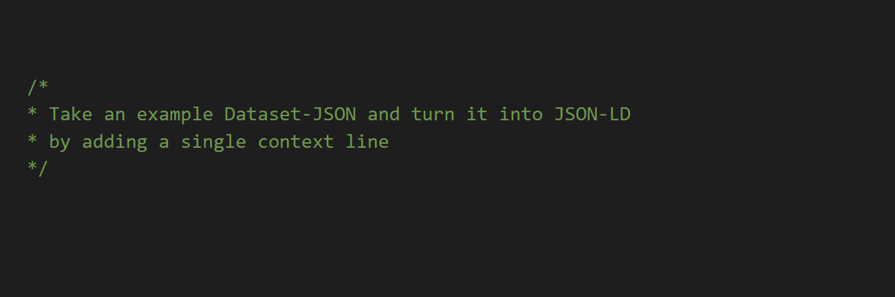
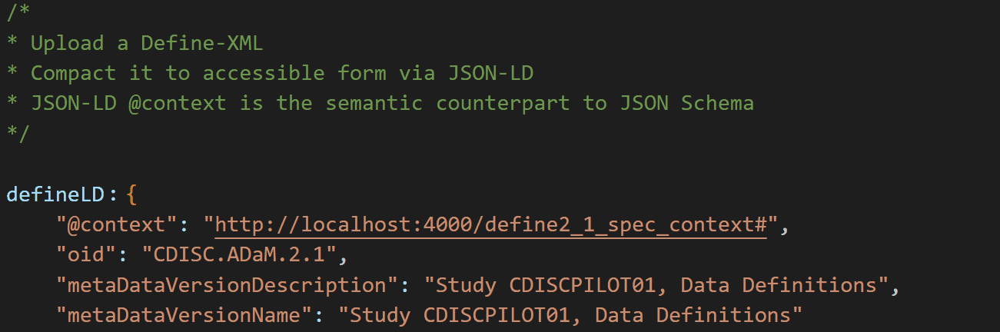

# CDISC Over Linked Data (JSON-LD)

This repository should be used for the [CDISC Open Source Alliance's Dataset-JSON Hackathon](https://wiki.cdisc.org/display/DSJSONHACK) to contain code, minutes, notes, outcomes, discussions and more. It is meant to allow anyone working with the results and discussions to allow flexible collaboration and follow up projects.

<p align="middle">
    
    
    
</p>

## Description

The main purpose of this project is to investigate ways in which the 
<a href="https://json-ld.org/" title="JSON-LD"></a> format can be leveraged in tandem with CDISC Datasets as JSON.

* [Dataset-JSON](https://wiki.cdisc.org/display/DSJSONHACK) is a new format being designed for a more interoperable way to communicate clinical data. 
* [JSON-LD](https://www.w3.org/TR/json-ld11/) may be able to complete the picture. 

**By imagining Dataset-JSON as the compacted form of a JSON-LD graph, a single machine-readable reference included in the Dataset-JSON can provide a complete description of the transfer.**

```js
"@context": "https://mdr.cdisc.org/transfer_104ab4/define_BS1234_v2#"
```

The referenced address would be the Define (or a transfer manifest referencing the Define) in the form of a JSON-LD, contextualising the Dataset-JSON contents into ODMv2 graph form

By changing the format of Define from XML to JSON-LD context & graph, the Define is served as a common spec that can be referenced *explicitly* from Dataset-JSON (as opposed to *implicitly* via `metadataVersionOID`)

### Dataset-JSON can reference Define via a explicit reference to your transfer manifest (using JSON-LD)


Have your cake and eat it! Simple streamable datasets for transport, linked explicitly to a single source of truth. A complete metadata picture that allows the data to be queried and exported as a graph

See [Instructions](documents/instructions.md) to set up and run the demo server

See [JSON-LD Overview](documents/json-ld.md) to learn more about how this project proposes to apply JSON-LD to CDISC data and metadata

See [Define via Manifest Demo](documents/manifest_demo.md) to see how Dataset-JSON can reference Define spec explicitly via a single explicit reference to its transfer manifest (replace Define-XML file with a URL)

See [JSON-LD Demo](documents/json-ld_demo.md) to go through some examples and interact with them via the JSON-LD Playground tool

See [Define-LD Overview](documents/define-ld.md) (in progress) to see how JSON-LD can be applied to Define to make it more interoperable

Experiment with [Streaming JSON-LD in Python test](examples/stream_test.py) to benchmark streaming various sizes of dataset-JSON files with and without import from JSON-LD-powered Define API

### Transfer to [compacted](src/public/output_compacted.json), [expanded](src/public/output_expanded.json), and [RDF](src/public/output_rdf_normalised.nq) formats by including a JSON-LD `@context`
Click the respective formats to see this in action (as shown in video below)


### Dataset-JSON transformed to RDF via JSON-LD
```
<http://localhost:4000/transfer_104ab4/define_BS1234_v2/IG.DM> <http://schema.org/VariableMeasured> <http://localhost:4000/transfer_104ab4/define_BS1234_v2/ITEMGROUPDATASEQ> .
<http://localhost:4000/transfer_104ab4/define_BS1234_v2/IG.DM> <http://schema.org/description> "Demographics"^^<http://schema.org/PropertyValue> .
<http://localhost:4000/transfer_104ab4/define_BS1234_v2/IG.DM> <http://schema.org/maxValue> "600"^^<http://www.w3.org/2001/XMLSchema#nonNegativeInteger> .
<http://localhost:4000/transfer_104ab4/define_BS1234_v2/IG.DM> <http://schema.org/name> "DM"^^<http://schema.org/PropertyValue> .
<http://localhost:4000/transfer_104ab4/define_BS1234_v2/IT.USUBJID> <http://schema.org/DataType> "string"^^<http://schema.org/PropertyValue> .
<http://localhost:4000/transfer_104ab4/define_BS1234_v2/IT.USUBJID> <http://schema.org/description> "Unique Subject Identifier"^^<http://schema.org/PropertyValue> .
<http://localhost:4000/transfer_104ab4/define_BS1234_v2/IT.USUBJID> <http://schema.org/name> "USUBJID"^^<http://schema.org/PropertyValue> .
<http://localhost:4000/transfer_104ab4/define_BS1234_v2/IT.USUBJID> <http://www.w3.org/2001/XMLSchema#length> "3"^^<http://www.w3.org/2001/XMLSchema#nonNegativeInteger> .
<http://localhost:4000/transfer_104ab4/define_BS1234_v2/ITEMGROUPDATASEQ> <http://schema.org/DataType> "integer"^^<http://schema.org/PropertyValue> .
<http://localhost:4000/transfer_104ab4/define_BS1234_v2/ITEMGROUPDATASEQ> <http://schema.org/description> "Record identifier"^^<http://schema.org/PropertyValue> .
<http://localhost:4000/transfer_104ab4/define_BS1234_v2/ITEMGROUPDATASEQ> <http://schema.org/name> "ITEMGROUPDATASEQ"^^<http://schema.org/PropertyValue> .
_:b0 <http://schema.org/Dataset> <http://localhost:4000/transfer_104ab4/define_BS1234_v2/IG.DM> .
```

## Conclusions and next steps
So far we have shown JSON-LD as a means of transforming Define-JSON and Dataset-JSON into a graph.

JSON-LD brings Dataset and Define together explicitly by turning IDs and references into graph nodes and connections with universally unique IDs

Next steps: PoC expression of Define in JSON-LD `@graph` form to provides a semantic blueprint layer to the Define specifications with well-defined nodes and relations


## Contribution

Contribution is very welcome. When you contribute to this repository you are doing so under the below licenses. Please checkout [Contribution](CONTRIBUTING.md) for additional information. All contributions must adhere to the following [Code of Conduct](CODE_OF_CONDUCT.md).

## License

 

### Code & Scripts

This project is using the [MIT](http://www.opensource.org/licenses/MIT "The MIT License | Open Source Initiative") license (see [`LICENSE`](LICENSE)) for code and scripts.

### Content

The content files like documentation and minutes are released under [CC-BY-4.0](https://creativecommons.org/licenses/by/4.0/). This does not include trademark permissions.

## Re-use

When you re-use the source, keep or copy the license information also in the source code files. When you re-use the source in proprietary software or distribute binaries (derived or underived), copy additionally the license text to a third-party-licenses file or similar.

When you want to re-use and refer to the content, please do so like the following:

> Content based on [Dataset-JSON Define-LD Demo (GitHub)](https://github.com/TeMeta/Dataset-JSON_hackathon) used under the [CC-BY-4.0](https://creativecommons.org/licenses/by/4.0/) license.
